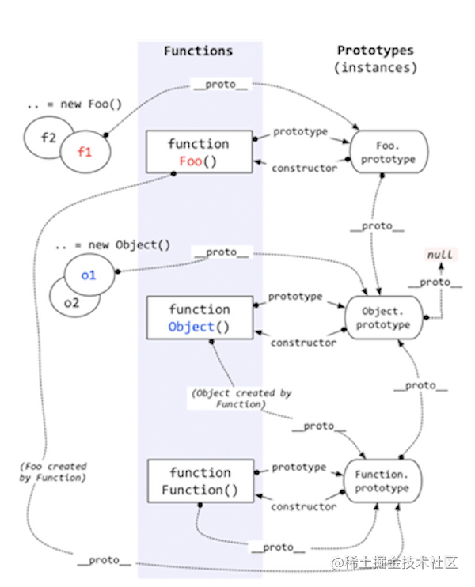

# instanceof

`instanceof` 一般用来判断引用类型的具体类型，其实其的主要作用就是判断一个实例是否属于某种类型

```javascript
let person = function () {
}
let programmer = function () {
}

programmer.prototype = new person()
let nicole = new programmer()

nicole instanceof person // true
nicole instanceof programmer // true
```

## 原理
通过上面的例子也不难看出，`instanceof` 的原理就是寻找右边变量的 `prototype` 在左边变量的原型链上即可。

如果遍历到 `object.prototype` 还没有寻找到，说明寻找失败，返回 `false`

```javascript
function Foo() {
}

Object instanceof Object // true
Function instanceof Function // true
Function instanceof Object // true
Foo instanceof Foo // false
Foo instanceof Object // true
Foo instanceof Function // true
```



我们知道每个 JS 对象均有一个隐式的 `__proto__` 原型属性，而显示的原型属于是 `prototype`，只有 `Object.protoype.__proto__` 属性在未修改的情况下位 `null`。

根据上图的原理，我们来梳理几个有趣的 `instanceof` 例子

- object instanceof object

由图可知，`Object` 的 `prototype` 属性是 `Object.prototype`，而由于 `Object` 本身是一个函数，由 `Function` 所创建，所以 `Object.__proto__ === Function.prototype`，而 `Function.prototype.__proto__ === Object.prototype`，所以我们可以推断该例子为 true

```javascript
leftValue = Object.__proto__ = Function.prototype;
rightValue = Object.prototype;
// 第一次判断
leftValue != rightValue
leftValue = Function.prototype.__proto__ = Object.prototype

// 第二次判断
leftValue === rightValue // true
```

- Foo instanceof Foo

Foo 函数的 `prototype` 属性是 `Foo.prototype`，而 Foo 的 `__proto__` 属性是 `Function.prototype`，由图可知，Foo 的原型链上并没有 `Foo.prototype` ，因此 Foo instanceof Foo 也就返回 false。

```javascript
leftValue = Foo, rightValue = Foo
leftValue = Foo.__proto = Function.prototype
rightValue = Foo.prototype
// 第一次判断
leftValue != rightValue
leftValue = Function.prototype.__proto__ = Object.prototype
// 第二次判断
leftValue != rightValue
leftValue = Object.prototype = null
// 第三次判断
leftValue === null // false
```

## 实现
```javascript
function instance_of (left, right) {
    let proto = Object.getPrototypeOf(left)
    let prototype = right.prototype
    while(proto) {
        if (proto === prototype) return true
        proto = object.getPrototypePf(proto)
    }
    return false
}
```